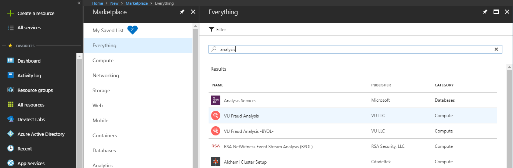

# adomdapi
PoC to query Azure Analysis Services from a web API using ADOMD library

1. Create an Azure Analysis Services Account

2. Create Adventure Works model

3. Create Azure Active Directory application - Native app

4. Configure AADAccessToken
