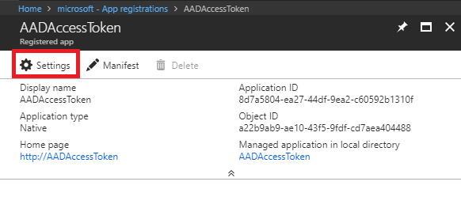

# adomdapi
PoC to query Azure Analysis Services from a web API using ADOMD library

**1. Create an Azure Analysis Services Account**

**Server Name**: The name of your Analysis Server.  
**Subscription**: The Azure subscription you want to use.  
**Resource group**: You can choose an existing resource group or create a new one.  
**Location**: Select the datacenter where you want to deploy your service.  
**Pricing tier**: B1 would be enough for this demo.  
**Administrator**: Your account is chosen by default.  
**Backup Storage Settings**: You must select or create a storage account.  
**Storage key expiration**: It can be Never for this demo.  

**2. Create Adventure Works model**

Once you have your Analysis Service account created you need to create a model. For this PoC we chose the Adventure Works model. Click on **+ New Model**:

Sample data will be selected so you just need to click **Add**.

**3. Create Azure Active Directory application - Native app.**

In order to get an access token that gives you access to the Analysis Service account you have to create an Azure Active Directory Application. Click on Azure Active Directory on the portal, select **App registrations** and click on **+ New application registration** in the top menu. You will need:

**Name**: the name of your application.  
**Application type**: Native
**Redirect URI**: You can choose the URI what you want. It doesn't need to be a physical endpoint.

The final step is to give access to this application to Azure Analysis Services. Click on **Settings**:

Selected **Required permissions**, click on **+ Add** and search for Azure Analysis Services and select it.

Check on **Read and Write all Models** and click on **Done** to finish the configuration.

**4. Configure AADAccessToken.**

This are the App Settings you have to configure in the AADAccessToken program:

    <!--Azure Active Directory values-->
    <add key="aad:RedirectUri" value="[Reply URL from you Azure Active Directory Native App]"/>
    <add key="aad:Authority" value="https://login.windows.net/common"/>
    <add key="aad:ClientId" value="[Your Azure Active Directory App Id]"/>
    <!-- Azure Analysis Services -->
    <add key="aad:ResourceUri" value="https://westeurope.asazure.windows.net"/>
    <!-- End Azure Active Directory values-->
    <!-- Web API URL-->
    <add key="apiUrl" value="http://localhost:50117/api/values/?query="/>    

**5. Configure WebAPI**

The only parameter you need to configure as App Setting is the Azure Analysis Service data source.

    <!-- Azure Analysis Services -->    
    <add key="asDataSource" value="[Azure Analysis Services Data Source - ex: asazure://westeurope.asazure.windows.net/returngis]"/>
    <!-- End Azure Analysis Services -->

**6. Test it!**

Run both projects and login with your credentials for the console. Once you have successfuly logged you can see the next message:

If you are using the adventure works model you can test one of these queries:

Evaluate TOPN(10,Customer,Customer[Customer Id],1)

![Evaluate TOPN(10,Customer,Customer[Customer Id],1)](./screenshots/Query-1.png)

Evaluate(ROW("Count",COUNTROWS('Product')))

